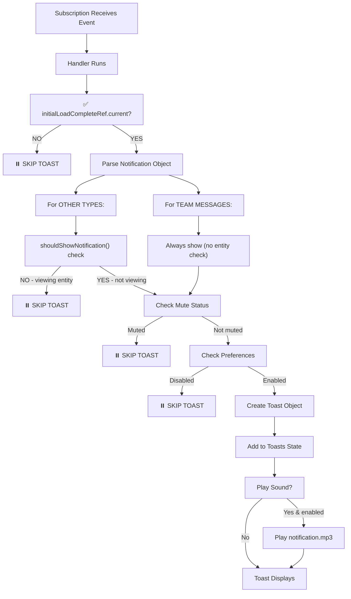

# Complete Notification System Flow & Conditions

## 🎯 Where Notifications Get Created

### **1. TEAM MESSAGES** → `team_message` type
**Source:** `src/context/NotificationContext.tsx` (lines 474-658)

#### Trigger Conditions:
- Event: `INSERT` on `team_messages` table
- Filter: `company_id=eq.${companyId}`
- **CRITICAL:** Must check:
  - ✅ Message sender_id ≠ current userId (skip own messages)
  - ✅ Team exists and user has SELECT permission
  - ✅ User IS a member of the team (`team_members` table)
  - ✅ User is part of the company

#### Notification Saved To Database:
```
notifications table INSERT with:
- user_id: current user
- title: "New message in {team_name}"
- message: "{sender}: {content_preview}"
- type: "team_message"
- entity_type: "team"
- entity_id: team_id
- sender_name: full_name of sender
- link: /app/teams/{team_id}
```

#### Toast Conditions:
- ✅ INSERT subscription receives notification (saved to DB)
- ✅ initialLoadCompleteRef.current === true
- ✅ shouldShowNotification() check: user NOT viewing that team chat
- ✅ Preferences: enablePushNotifications === true (for team messages)
- ✅ Not muted (Date.now() >= muteUntilRef.current)

---

### **2. TICKET ASSIGNMENTS** → `ticket_assigned` type
**Source:** `src/context/NotificationContext.tsx` (lines 717-784)

#### Trigger Conditions:
- Event: `UPDATE` on `tickets` table
- Filter: `assigned_to=eq.${userId}`
- **CRITICAL:** Check:
  - ✅ `old.assigned_to !== userId && new.assigned_to === userId` (newly assigned)
  - ✅ Ticket exists and is accessible

#### Notification Stored:
- **NOT saved to DB** (direct state update only)
- Created as temp notification with ID: `temp-ticket-${ticket.id}-${Date.now()}`

#### Toast Conditions:
- ✅ initialLoadCompleteRef.current === true
- ✅ showToastRef.current exists (function available)
- ✅ shouldShowNotification() check: user NOT viewing that ticket
- ✅ Preferences: enableTicketUpdates === true
- ✅ Not muted

**⚠️ PROBLEM:** Temp notifications won't persist after reload!

---

### **3. TICKET STATUS CHANGES** → `ticket_status_changed` type
**Source:** `src/context/NotificationContext.tsx` (lines 786-810)

#### Trigger Conditions:
- Event: `UPDATE` on `tickets` table
- Filter: `assigned_to=eq.${userId}`
- **CRITICAL:** Check:
  - ✅ `old.status !== new.status` (status changed)
  - ✅ `ticket.assigned_to === userId` (user is still assigned)
  - ✅ Ticket exists

#### Notification Stored:
- **NOT saved to DB** (direct state update only)
- Created as temp notification with ID: `temp-ticket-status-${ticket.id}-${Date.now()}`

#### Toast Conditions:
- ✅ initialLoadCompleteRef.current === true
- ✅ showToastRef.current exists
- ✅ shouldShowNotification() check: user NOT viewing that ticket
- ✅ Preferences: enableTicketUpdates === true
- ✅ Not muted

**⚠️ PROBLEM:** Temp notifications won't persist after reload!

---

### **4. TICKET COMMENTS** → `ticket_commented` type
**Source:** `src/context/NotificationContext.tsx` (lines 812-905)

#### Trigger Conditions:
- Event: `INSERT` on `ticket_comments` table
- No filter (all companies)
- **CRITICAL:** Async checks:
  - ✅ Comment creator_id ≠ userId (skip own comments)
  - ✅ Ticket exists: fetch from `tickets` table
  - ✅ User IS assigned to this ticket: `ticket.assigned_to === userId`
  - ✅ Can read commenter info from `users` table

#### Notification Stored:
- **NOT saved to DB** (direct state update only)
- Created as temp notification with ID: `temp-comment-${comment.id}-${Date.now()}`

#### Toast Conditions:
- ✅ initialLoadCompleteRef.current === true
- ✅ showToastRef.current exists
- ✅ shouldShowNotification() check: user NOT viewing that ticket
- ✅ Preferences: enableComments === true
- ✅ Not muted

**⚠️ PROBLEM:** Temp notifications won't persist after reload!

---

### **5. ASSET ASSIGNMENTS** → `asset_assigned` type
**Source:** `src/context/NotificationContext.tsx` (lines 907-974)

#### Trigger Conditions:
- Event: `UPDATE` on `assets` table
- Filter: `assigned_to=eq.${userId}`
- **CRITICAL:** Check:
  - ✅ `old.assigned_to !== userId && new.assigned_to === userId` (newly assigned)
  - ✅ Asset exists

#### Notification Stored:
- **NOT saved to DB** (direct state update only)
- Created as temp notification with ID: `temp-asset-${asset.id}-${Date.now()}`

#### Toast Conditions:
- ✅ initialLoadCompleteRef.current === true
- ✅ showToastRef.current exists
- ✅ shouldShowNotification() check: user NOT viewing that asset
- ✅ Preferences: enablePushNotifications === true
- ✅ Not muted

---

### **6. ASSET STATUS CHANGES** → `asset_updated` type
**Source:** `src/context/NotificationContext.tsx` (lines 976-1000)

#### Trigger Conditions:
- Event: `UPDATE` on `assets` table
- Filter: `assigned_to=eq.${userId}`
- **CRITICAL:** Check:
  - ✅ `old.status !== new.status` (status changed)
  - ✅ `asset.assigned_to === userId` (user still assigned)
  - ✅ Asset exists

#### Notification Stored:
- **NOT saved to DB** (direct state update only)
- Created as temp notification with ID: `temp-asset-status-${asset.id}-${Date.now()}`

#### Toast Conditions:
- ✅ initialLoadCompleteRef.current === true
- ✅ showToastRef.current exists
- ✅ shouldShowNotification() check: user NOT viewing that asset
- ✅ Preferences: enablePushNotifications === true
- ✅ Not muted

---

## 🔄 Toast Display Flow (Complete Checklist)



## 🚨 Critical Issues Found

### **1. MISSING DATABASE PERSISTENCE** ⚠️
**Notification Types Affected:** ticket_assigned, ticket_status_changed, ticket_commented, asset_assigned, asset_updated

**Problem:** These notifications are created as **temp objects** with IDs like `temp-ticket-123-1234567890`. They are NOT saved to the `notifications` table. Therefore:
- ❌ Don't persist after page reload
- ❌ Don't appear in notification history/badge count on subsequent visits
- ✅ Only exist in memory while page is open

**Solution:** Save these to `notifications` table BEFORE showing toast (like team messages do)

---

### **2. Toast Not Showing - Possible Causes**

#### ✅ Condition 1: `initialLoadCompleteRef.current === false`
- **Check:** Open browser console - look for "Initial load complete"
- **If Missing:** fetchNotifications() didn't complete
- **Fix:** Check if subscriptions are connecting properly

#### ✅ Condition 2: Subscriptions Not Connected
- **Check:** Console for "Successfully subscribed to X channel"
- **If Missing:** postgres_changes subscriptions failed
- **Likely Cause:** 
  - RLS policies blocking subscription
  - Network error connecting to Supabase
  - User/Company ID not set properly

#### ✅ Condition 3: `shouldShowNotification()` Returning False
- **Check:** Console logs for "⏸️ User is viewing entity, skipping notification"
- **If Seeing:** User already on that page - expected behavior
- **If NOT Seeing:** Proceed to next condition

#### ✅ Condition 4: Notifications Are Muted
- **Check:** Look for "🔇 Notifications are muted"
- **If Seeing:** User has notifications muted in settings
- **Fix:** Check mute duration setting and current time

#### ✅ Condition 5: Preferences Blocking Notifications
- **Check:** Console logs for "⏸️ X notifications disabled"
- **If Seeing:** User disabled that notification type in preferences
- **Fix:** Open Settings → Notifications → Enable the type

#### ✅ Condition 6: ToastContainer Not Mounted
- **Check:** Inspect App.tsx - verify NotificationProvider wraps everything
- **Check:** Verify ToastWrapper component exists in App.tsx
- **If Missing:** ToastContainer never renders

#### ✅ Condition 7: Toast State Not Updating
- **Check:** Console for "🔔 Showing notification toast:" messages
- **If Missing:** setToasts() call never executed
- **If Seeing:** But toast not visible - check CSS (z-index, display property)

---

## 📋 Notification Preferences Validation

**Location:** `src/context/NotificationContext.tsx` lines 23-29

```typescript
type NotificationPreferences = {
  enableEmailNotifications: boolean        // NOT USED YET
  enablePushNotifications: boolean         // team_message, asset updates
  enableTicketUpdates: boolean             // ticket assignment, status change
  enableComments: boolean                  // ticket comments
  enableSoundNotifications: boolean        // Sound for all notifications
  notificationMuteDuration: 'never' | '5min' | '30min' | '1hour' | '8hours'  // Mute duration
}
```

**Checked In:**
- `showToast()` function (line 188-210)
- INSERT subscription for team_messages (line 351-365)
- INSERT subscription for notifications (line 410-440)

---

## 🔍 How To Debug

### **Step 1: Check Console Logs**
Open Browser DevTools → Console tab and look for:
```
✅ Initial load complete, subscriptions ready
📡 Notifications channel subscription status: SUBSCRIBED
✅ Successfully subscribed to notifications channel
📬 New notification received: {notification}
🔔 Showing notification toast: {title}
```

If any of these are missing → that's your breakpoint!

### **Step 2: Create Manual Test Notification**
Run in browser console:
```javascript
// Directly create a notification in the table
const { data, error } = await supabase.from('notifications').insert({
  user_id: 'YOUR_USER_ID',
  title: 'Test Toast',
  message: 'This is a test',
  type: 'team_message',
  read: false,
  entity_type: 'team',
  entity_id: 'test-id'
})
```

**Expected Result:** Toast appears immediately

### **Step 3: Verify Subscription Status**
Run in console:
```javascript
// Check if subscription connected
console.log('Supabase Realtime Status:', supabase.getChannels())
```

### **Step 4: Check ToastContainer Rendering**
In React DevTools:
- Search for "ToastContainer" component
- If not found → Provider not mounted or component not imported
- If found → Check if toasts array is populated in NotificationContext state

---

## 📊 Summary Table

| Notification Type | Created By | Saved To DB | Persists After Reload | Subscription | Toast Conditions |
|---|---|---|---|---|---|
| team_message | Subscription + Handler | ✅ YES | ✅ YES | INSERT team_messages | After initial load |
| ticket_assigned | Subscription Handler | ❌ NO | ❌ NO | UPDATE tickets | After initial load |
| ticket_status_changed | Subscription Handler | ❌ NO | ❌ NO | UPDATE tickets | After initial load |
| ticket_commented | Subscription Handler | ❌ NO | ❌ NO | INSERT ticket_comments | After initial load |
| asset_assigned | Subscription Handler | ❌ NO | ❌ NO | UPDATE assets | After initial load |
| asset_updated | Subscription Handler | ❌ NO | ❌ NO | UPDATE assets | After initial load |

---

## 🎯 Most Likely Problem

**The subscriptions are probably working BUT:**

1. **`initialLoadCompleteRef.current` is FALSE** when notifications arrive
   - Toast handler checks this flag before showing
   - If initial fetchNotifications() is still pending → no toasts show
   
2. **OR ToastContainer is not rendering** despite toasts being in state
   - Verify App.tsx has `<ToastWrapper>` component
   - Check if NotificationProvider wraps entire app
   - Look for any error boundaries that might hide components

3. **OR Preferences are blocking ALL notification types**
   - Check localStorage for notification preferences
   - Verify at least one preference is enabled

**Quick Fix To Try:**
```javascript
// In browser console
localStorage.removeItem('notification-preferences')
// Then refresh page
```

This resets preferences to defaults where all notifications are enabled.
